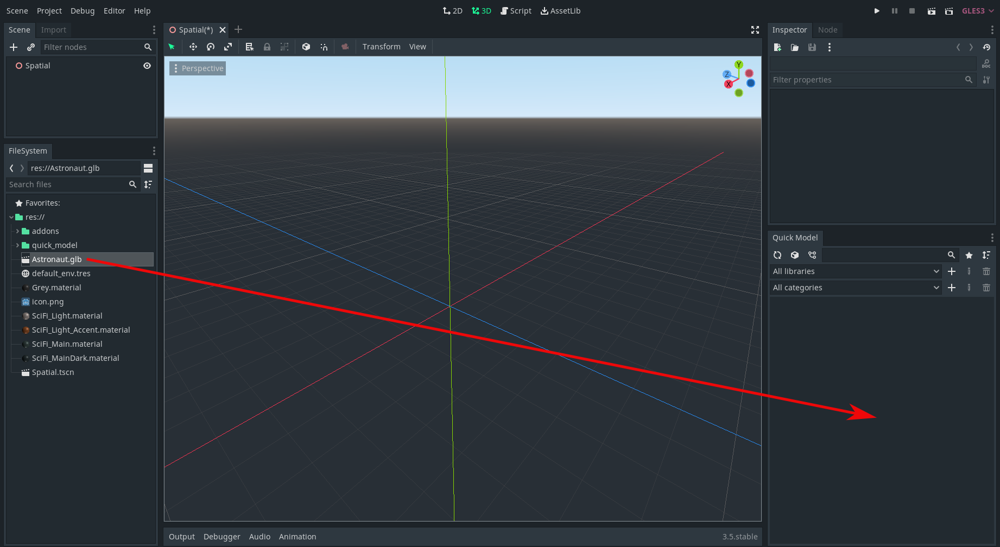
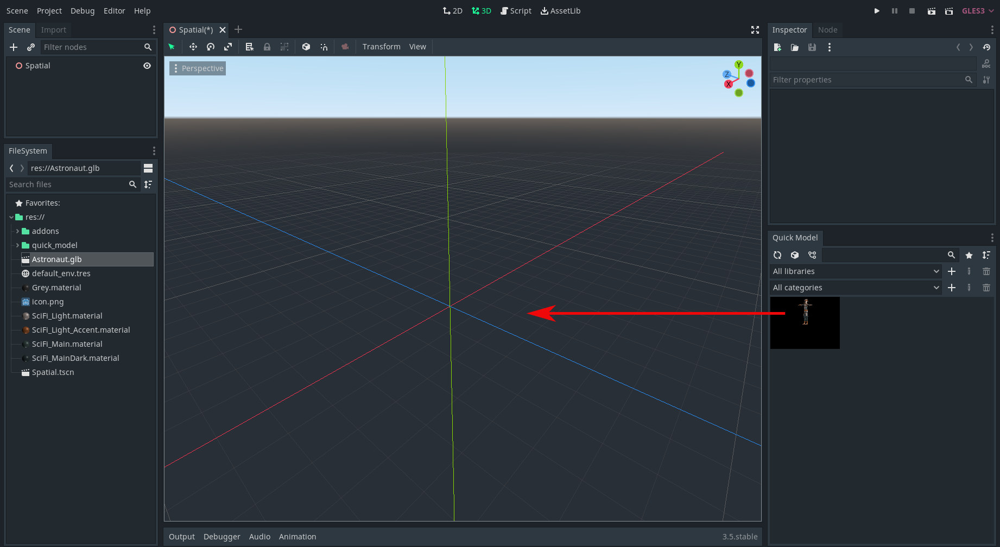

# Basics

## Getting Started
Quick Model is automatically opened to the dock after installation.

## How To Add a Model to the Library

Drag and drop a model from the file system to the Quick Model dock. Then add all information you want in the add new model window and click **Create**. Ensure you have filled all the required fields (marked with stars).

## How To Remove a Model From the Library
Right-click the model icon on the dock and click **Remove** on the context menu.
You can also select multiple models with a left-click and then right-click to open the context menu to remove all.
Note: You cannot remove models from the pre-made "Low poly" library.

## How To Add a Model to the Project

Drag and drop a model from Quick Model dock to the scene or file system to add it to the project.

## How To Remove a Model From the Project
Open project manager, right-click on the model you want to remove and click **Remove**.
You can also select multiple models with a left-click and then right-click to open context menu to remove all.

## Why my model won't load when I drag it into the scene?
Sometimes Godot won't properly reimport all new files. To trigger reimporting, you can click on another window and then go back to Godot.