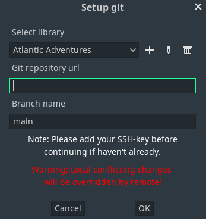

# Git Integration

## How To Setup Git Integration

1. First you need to install the latest Git version control system from [Gits official website](
https://git-scm.com/).

2. Open command prompt and enter command:
```
git --version
```

If you get a command not recognized error, you need to add Git to the path.
Find more information on how to do that here:
https://www.delftstack.com/howto/git/add-git-to-path-on-windows/

3. Click **Git version control button**  to open context menu, then click on **Setup git**.

4. New popup should now open:



- Select library you want to use with Git
- Copy SSH-repository url from Github, Gitlab, etc.
- Set branch name
5. Click on OK.

## I'm Getting "Host key verification failed" Error
See this Stackoverflow answer on how to fix it.
https://stackoverflow.com/questions/13363553/git-error-host-key-verification-failed-when-connecting-to-remote-repository
