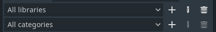

# Libraries and Categories

## How To Add Library
Click the +-button next to the library selector, type a name for the library and click **Create**.

## How To Add Category
Click the +-button next to the category selector, type a name for the category and click **Create**.

## How To Edit/Remove Library/Category
Click the pencil icon to edit or the trash can icon to remove a library or category.
Note: You cannot edit or remove pre-made Low poly library or it's categories.

## How To Copy All Licenses From Models in Project

Open the **Project Manager** by clicking the cube icon and click **Copy all licenses to the clipboard**.

## How To Update the Model Metadata in a Project if It Has Been Changed on the Library
Right-click a model and select **Update data in the project** on the context menu.
