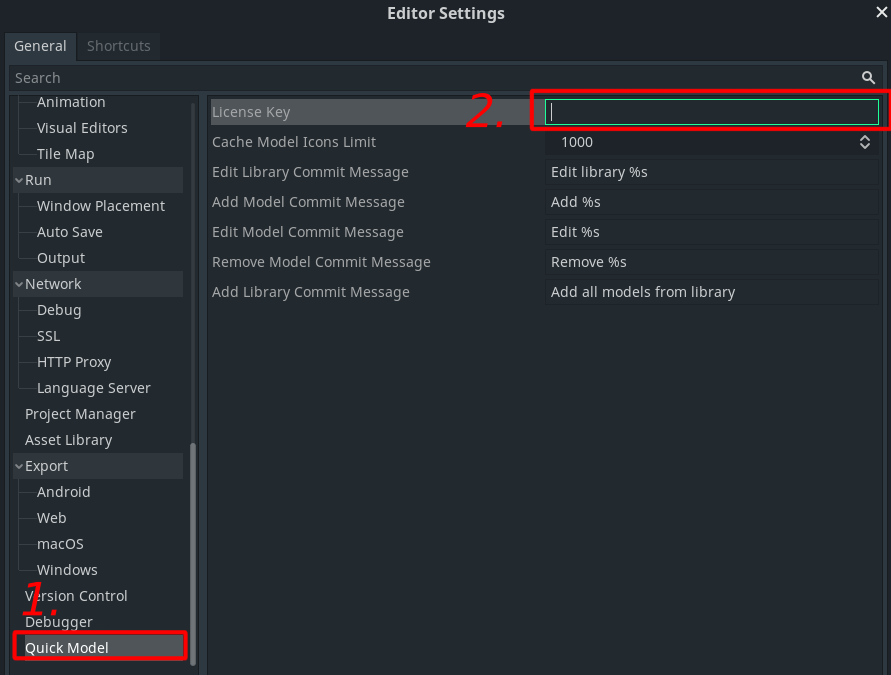

# Setup

## How to install and activate the plugin
Installation instructions for plugins can be found in [Godot's documentation](https://docs.godotengine.org/en/stable/tutorials/plugins/editor/installing_plugins.html).

## How to add license key

Open Godot's **Editor Settings**. The Quick Model settings are located in the **Quick Model** tab in the left column. There copy your Itch.io download key to **Licence Key** field. (Your download key is the last part in the download url.)

## How to change the location of the model files in the project

Open **project settings**. Click on **Quick Model** tab in the left column and change model files location to your liking. By default the models are located in the **quick_model** folder.
