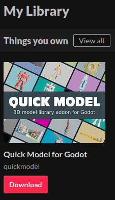

# Setup

## How to install and activate the plugin
Installation instructions for plugins can be found in [Godot's documentation](https://docs.godotengine.org/en/stable/tutorials/plugins/editor/installing_plugins.html).

## How to add license key

Open Godot's **Editor Settings**. The Quick Model settings are located in the **Quick Model** tab in the left column. There, copy your Itch.io download key to the **Licence Key** field. (Your download key is the last part in the download URL.)
The download key can be extracted from the download URL provided by Itch.io. For example:
https://quickmodel.itch.io/quick-model-godot/download/abc123

The download key would be: abc123

Note: If assets have not loaded when you set the key, you need to reload assets by clicking Reload -> Force reload assets.

## How to get download URL from Itch.io

1. Open your library.
2. Click on the download-button and copy the url from your browser.

## How to change the location of the model files in the project

Open **project settings**. Click on the **Quick Model** tab in the left column and change the model files location to your liking. By default, the models are located in the **quick_model** folder.
Note: In Godot 4, make sure you have advanced settings toggled on.
