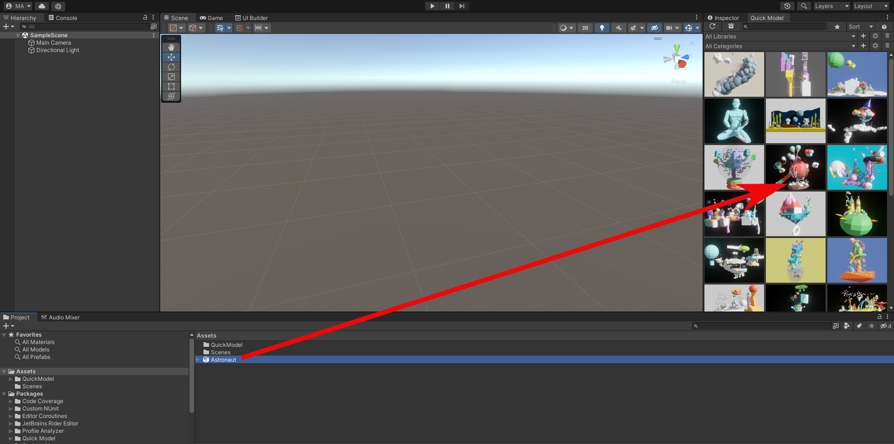
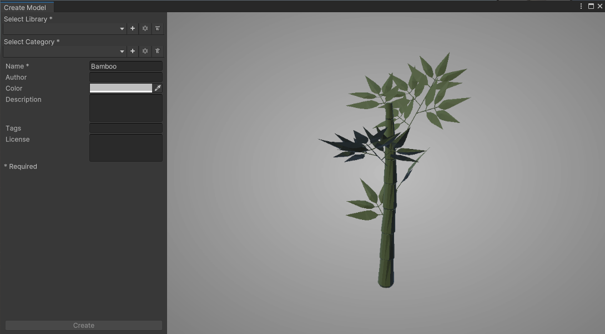
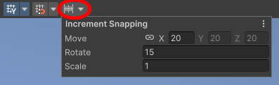
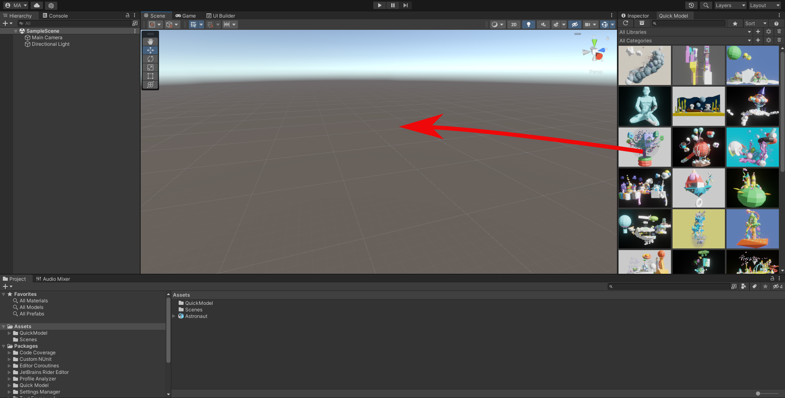

# Basics

## Getting Started
Navigate to Window -> Quick Model -> Quick Model to open the editor window.
Loading default assets from the API can take some time. Make sure you are connected to the internet.

## Folders
Quick Model automatically creates some folders to your Unity-project when you first install it. Here they are:

**Assets/QuickModel** - These are the models you have added to your project from libraries.

**Asset/QuickModelGlobal** - These are all of your models, you have added to a library.

**Library/QuickModel** - Currently an icon cache and list of all default models in a json-format.

**Temp/QuickModel** - a temp folder, for example preview models are stored here.

## How To Add a Model to the Library

Drag and drop a model from file system or project window to the Quick Model window.

Then add all information you want in the add new model window and click **Create**. Ensure you have filled all the required fields (marked with stars). You can also skip this step by selecting library and category beforehand and then drop models while holding ctrl-key.

Note: It is highly recommended to use prefabs as they contain everything related to that model in one package. When you add a new model to a library, only the file you drop is copied over, not textures and other files related to it.

## How To Preview a Model
Double click on a model icon or right-click it and select **View**. Then you should see a window pop up with model preview and metadata associated with it.
If model does not load, make sure you are connected to the internet and your application is not paused.

## Prefab/Model Placement
First you can select the game object from the scene you want to place new models under, then click the model you want to place in the scene by clicking on the model preview icon on Quick Model window.
Press shift + WASD keys to rotate, U to toggle normal snapping or ESC-key to cancel if you decide to use another model.
You can also toggle ground snapping by pressing G-key.
By holding CTRL you can activate incremental snapping. You can also drag and drop model to the scene. Grid snapping can also be enabled from the menu.
If nothing happens when you press buttons make sure you have the scene view focused by clicking on it.

## How To Remove a Model From the Library
Right-click the model icon on the dock and click **Remove** on the context menu.
You can also select multiple models with a left-click and then right-click to open the context menu to remove all.
Note: You cannot remove models from the pre-made "Low poly" library.

## How To Add a Model to the Project

Drag and drop a model from Quick Model dock to the scene or file system to add it to the project.

## How To Remove a Model From the Project
Open project manager, right-click on the model you want to remove and click **Remove**.
You can also select multiple models with a left-click and then right-click to open context menu to remove all.
