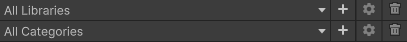
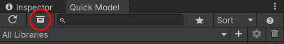

# Libraries and categories

## Add library
Click the +-button next to the library selector, type a name for the library and click **Create**.

## Add category
Click the +-button next to the category selector, type a name for the category and click **Create**.

## Edit library/category
Click the gear icon to edit a library or category.

## Remove library/category
Click the trash can icon to remove a library or category.

## Copy licenses of all assets in a project

Open the **Project Manager** by clicking the drawer icon and click **Copy all licenses to the clipboard**.

## Update project asset metadata
If you have made some metadata changes in a global asset and want to update the changes to a project asset as well.
Right-click an asset and select **Update data in the project** on the context menu.

Note: Model metadata is also updated when importing an asset
